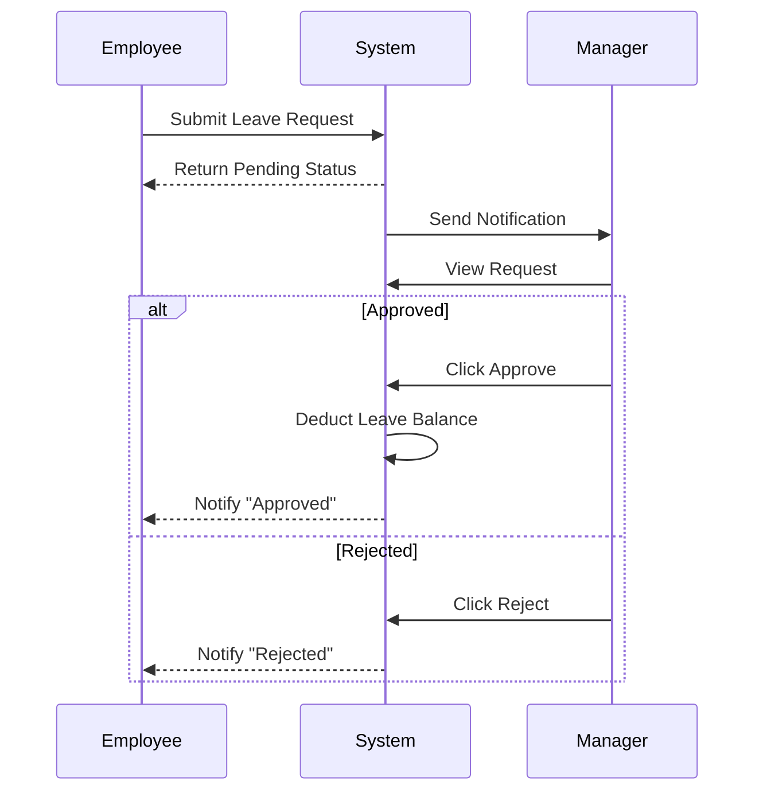
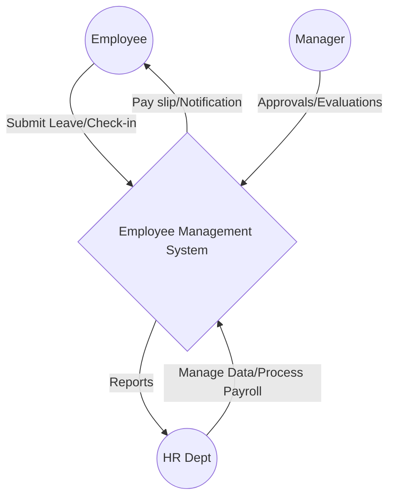

# PHÂN TÍCH NGHIỆP VỤ TOÀN DIỆN: HỆ THỐNG QUẢN LÝ NHÂN VIÊN (EMS)

## 01. EXECUTIVE SUMMARY
Hệ thống Quản lý Nhân viên (Employee Management System - EMS) là giải pháp phần mềm nội bộ nhằm số hóa và tự động hóa toàn bộ vòng đời nhân sự trong doanh nghiệp. Hệ thống được xây dựng trên nền tảng Django (Monolithic) kết hợp Server-Side Rendering (SSR) và cơ sở dữ liệu MySQL, tập trung vào tính bảo mật, tính nhất quán dữ liệu, và quản lý tập trung thay vì các tương tác giao diện phức tạp (SPA).

## 02. BUSINESS PROBLEM
- **Thủ công & Phân mảnh:** Quản lý nhân sự hiện tại qua Excel/giấy tờ dẫn đến phân mảnh dữ liệu, dễ thất lạc.
- **Sai sót chấm công & tính lương:** Việc tính lương thủ công tốn thời gian, dễ sai sót do không đồng bộ được dữ liệu chấm công, nghỉ phép và phụ cấp.
- **Thiếu minh bạch:** Nhân viên khó theo dõi ngày phép còn lại, lịch sử lương thưởng, và mục tiêu KPI.
- **Khó khăn trong quản trị:** Không có cái nhìn tổng quan về tình hình nhân sự, hiệu suất làm việc để ra quyết định điều chuyển/thăng tiến.

## 03. BUSINESS OBJECTIVES
- **Centralization (Tập trung):** 100% dữ liệu nhân sự, cấu trúc phòng ban được lưu trữ tập trung trên 1 hệ thống duy nhất.
- **Automation (Tự động hóa):** Tự động tính toán lương dựa trên chấm công, tự động cập nhật quỹ phép khi được phê duyệt.
- **Transparency (Minh bạch):** Cho phép nhân viên chủ động tra cứu thông tin cá nhân, quỹ phép, và bảng lương.
- **Compliance & Security (Bảo mật & Tuân thủ):** Đảm bảo an toàn dữ liệu nhạy cảm (lương, đánh giá) thông qua phân quyền chặt chẽ (RBAC).

## 04. SCOPE
**In-scope:** Quản lý Hồ sơ, Phòng ban, Chấm công, Nghỉ phép, Tính lương, Đánh giá Hiệu suất (Performance), Thông báo nội bộ, Báo cáo cơ bản.
**Out-of-scope (Hiện tại):** Tích hợp máy chấm công vân tay (chỉ nhập tay/import), Tuyển dụng (ATS), Quản lý tài sản (Asset Management).

## 05. STAKEHOLDERS

| Stakeholder | Goal | Responsibility | Permission | Main Functions |
|-------------|------|----------------|------------|----------------|
| **System Admin** | Hệ thống hoạt động ổn định, an toàn | Quản lý hạ tầng, tài khoản, backup | Full System | Quản lý Tài khoản, Phân quyền, Audit Log |
| **HR / Nhân sự** | Quản lý hồ sơ, lương, quy định chính xác | Nhập liệu hồ sơ, tính lương, duyệt phép | CRUD (HR Domains) | QL Nhân viên, Tính lương, Chấm công, Báo cáo |
| **Manager** | Đánh giá đúng năng lực, quản lý team hiệu quả | Phê duyệt phép, đánh giá KPI team | Team-scoped | Duyệt phép, Đánh giá nhân sự team, Báo cáo |
| **Employee** | Nắm bắt thông tin, minh bạch lương/phép | Tuân thủ nội quy, check-in, check-out | Own data | Check-in/out, Xin phép, Xem lương, Xem KPI |

## 06. ACTORS
1. **Primary Actors:** Admin, HR, Manager, Employee (Tương tác trực tiếp qua giao diện).
2. **Secondary Actors:** (Không có trong phase 1)
3. **External System:** 
   - *Email Gateway (SMTP):* Gửi email thông báo (cấp tài khoản, duyệt phép).

| Actor | Goal | Trigger | Input | Output |
|-------|------|---------|-------|--------|
| **Employee** | Xin nghỉ phép | Có nhu cầu nghỉ | Form nghỉ phép (Ngày, Lý do) | Yêu cầu chờ duyệt |
| **HR** | Tính lương cuối tháng | Ngày chốt công | Bảng công, Hệ số lương | Bảng lương |

## 07. BUSINESS DOMAINS
- **A. Employee Management:** Hồ sơ (thông tin cá nhân, CCCD, chức vụ).
- **B. Organization Management:** Cơ cấu (Phòng ban, Chức danh).
- **C. Attendance Management:** Chấm công (Check-in/out, số giờ làm).
- **D. Leave Management:** Ngày phép (Loại phép, quy trình duyệt, quỹ phép).
- **E. Payroll Management:** Lương (Công thức, Khấu trừ, Phụ cấp).
- **F. Performance Management:** Đánh giá KPI, định kỳ review.
- **G. Notification Management:** Gửi thông báo hệ thống/Email.
- **H. Reporting & Analytics:** Thống kê nhân sự, chi phí lương.
- **I. Authentication & Authorization:** Login, Đổi mật khẩu, RBAC.
- **J. System Administration:** Cấu hình hệ thống, Audit Log.

## 08. BUSINESS PROCESSES

### Employee Lifecycle (Vòng đời nhân sự)
- **Trigger:** Nhu cầu từ bộ phận hoặc ứng viên trúng tuyển.
- **Flow:** HR tạo Employee ➔ Hệ thống tự động tạo Account (Inactive) ➔ HR gán Phòng ban/Chức vụ ➔ Active Account ➔ (Chuyển công tác / Đánh giá) ➔ Cập nhật trạng thái (Resigned/Terminated).
- **Business Rule:** Chỉ HR/Admin mới được đổi trạng thái thành Terminated.

### Leave Approval Workflow (Quy trình nghỉ phép)
- **Trigger:** Nhân viên nộp đơn xin phép.
- **Flow:** Đơn tạo (Pending) ➔ Gửi Notification tới Manager ➔ Manager Review ➔ Approve/Reject ➔ Trừ Quỹ phép (nếu Approve) ➔ Notification tới Employee.
- **Exception Flow:** Nếu số ngày xin lớn hơn quỹ phép ➔ Hệ thống chặn ngay lúc submit (BR).

### Payroll Workflow
- **Pre-condition:** Đã chốt công cuối tháng.
- **Flow:** HR chọn kỳ lương ➔ Hệ thống tổng hợp: (Lương cơ bản / ngày công chuẩn) * ngày làm thực tế + Phụ cấp - Khấu trừ ➔ Draft Payroll ➔ HR duyệt (Approved) ➔ Gửi thông báo cho Nhân viên.

## 09. USE CASES
- **UC-01:** Đăng nhập hệ thống (Login)
- **UC-02:** Quản lý Hồ sơ Nhân viên (CRUD Employee)
- **UC-03:** Quản lý Cơ cấu Tổ chức (CRUD Department/Position)
- **UC-04:** Check-in / Check-out
- **UC-05:** Nộp đơn xin nghỉ phép (Create Leave Request)
- **UC-06:** Phê duyệt / Từ chối nghỉ phép (Approve/Reject Leave)
- **UC-07:** Tính lương tự động (Calculate Payroll)
- **UC-08:** Quản lý Phụ cấp / Khấu trừ (Manage Bonus/Deduction)
- **UC-09:** Đánh giá nhân sự (Evaluate Performance)
- **UC-10:** Xem Audit Log (View Audit Log)
- **UC-11:** Xuất báo cáo nhân sự (Export Report)

## 10. USE CASE SPECIFICATIONS

**UC-05: Create Leave Request**
- **Actor:** Employee, Manager, HR
- **Goal:** Nhân viên xin nghỉ phép thành công.
- **Preconditions:** Trạng thái tài khoản = Active, Quỹ phép > 0 (với phép năm).
- **Main Flow:**
  1. Actor chọn "Tạo đơn xin nghỉ".
  2. Chọn loại phép (Nghỉ ốm, Phép năm, ...), Ngày bắt đầu, Ngày kết thúc, Lý do.
  3. Hệ thống tính tổng số ngày xin nghỉ.
  4. Actor bấm Submit.
  5. Hệ thống lưu đơn (Pending), gửi thông báo cho Manager.
- **Exception Flow:**
  - *E1:* Khoảng thời gian xin nghỉ bị trùng với đơn trước đó ➔ Báo lỗi, yêu cầu nhập lại.
  - *E2:* Vượt quá số ngày phép còn lại (đối với Phép năm) ➔ Chặn submit.
- **Postconditions:** Sinh ra record LeaveRequest (Pending).
- **Permission:** Quyền Employee.

## 11. BUSINESS RULES
- **BR-001:** Mỗi nhân viên chỉ thuộc 1 phòng ban tại 1 thời điểm.
- **BR-002:** CCCD và Username phải là duy nhất (Unique) trên toàn hệ thống.
- **BR-003:** Không được xóa (Hard Delete) nhân viên đã có dữ liệu chấm công/lương. Chỉ được chuyển trạng thái Inactive.
- **BR-004:** Yêu cầu nghỉ phép phải được phê duyệt bởi người quản lý trực tiếp (Manager của Department đó) hoặc HR.
- **BR-005:** Nhân viên không được tự duyệt phép của chính mình [CONFLICT RESOLVED: Nếu Manager xin phép, HR hoặc Director sẽ duyệt].
- **BR-006:** Dữ liệu tính lương sau khi trạng thái "Approved" thì khóa (Locked), không ai được chỉnh sửa kể cả HR.
- **BR-007:** Mọi hành động thao tác dữ liệu (Thêm, Sửa, Xóa) phải được ghi nhận vào AuditLog (Actor, Action, Time, IP, Old Data, New Data).

## 12. ROLES & PERMISSIONS (RBAC)

| Module | Admin | HR | Manager | Employee |
|--------|-------|----|---------|----------|
| **Employee** | CRUD | CRUD | R (Team) | R (Own) |
| **Leave** | R | CRUD | Approve (Team)| Create, R (Own) |
| **Attendance** | R | CRUD | R (Team) | Create, R (Own)|
| **Payroll** | None | CRUD | None | R (Own) |
| **AuditLog** | CRUD | None | None | None |

*[NEED BUSINESS CONFIRMATION]: Admin có được quyền xem Lương không? Tạm định nghĩa: Không (chỉ HR & Director).*

## 13. DATA ENTITIES
- **User (Django Auth):** Quản lý đăng nhập (username, password, role).
- **Employee:** Profile mở rộng (full_name, cccd, dob, hometown, address, phone). *Relates to User (OneToOne), Department (ForeignKey).*
- **Department:** Phòng ban (name, manager_id).
- **Attendance:** Chấm công (employee_id, date, check_in_time, check_out_time, status).
- **LeaveRequest:** Đơn xin phép (employee_id, start_date, end_date, leave_type, reason, status).
- **Payroll:** Bảng lương tháng (employee_id, month, year, basic_salary, total_working_days, net_salary, status).
- **AuditLog:** (user_id, action, table_name, record_id, timestamp, details).

## 14. DATA FLOW (Ví dụ: Tính lương)
1. **HR** nhập lệnh "Tính lương tháng 10".
2. **Django View** nhận request, validate quyền HR.
3. **Payroll Service** truy vấn:
   - Danh sách Employee Active.
   - Lấy tổng ngày đi làm từ bảng `Attendance`.
   - Lấy tổng ngày nghỉ có lương từ bảng `LeaveRequest`.
   - Mức lương cơ sở từ bảng `Employee`.
4. **Processing (Logic):** Tính Net Salary = Lương cơ sở / Ngày chuẩn * (Ngày làm + Ngày phép) + Phụ cấp.
5. **Django ORM** lưu vào DB `Payroll`.
6. **Response:** Render HTML danh sách bảng lương trả về trình duyệt HR.

## 15. VALIDATION & 16. EXCEPTION HANDLING

| Error Code | Error Condition | System Response | User Message | Recovery Action |
|------------|-----------------|-----------------|--------------|-----------------|
| `ERR-EMP-01`| Trùng CCCD / Username | Ngăn chặn Save, Rollback DB | "CCCD hoặc Username đã tồn tại!" | Nhập lại dữ liệu khác |
| `ERR-LV-02`| Thiếu ngày phép | Ngăn chặn Submit Leave | "Số ngày phép của bạn không đủ." | Xin nghỉ không lương |
| `ERR-AUTH-03`| Session Timeout | Chuyển hướng về trang Login | "Phiên đăng nhập hết hạn." | Đăng nhập lại |
| `ERR-PAY-04`| Sửa lương đã chốt | Chặn hành động | "Bảng lương đã chốt, không thể sửa."| Yêu cầu Admin can thiệp |

## 17. FUNCTIONAL REQUIREMENTS
- **FR-01:** Hệ thống phải cho phép HR thêm mới 1 nhân viên và tự động sinh tài khoản.
- **FR-02:** Hệ thống phải cho phép nhân viên check-in/out bằng nút bấm.
- **FR-03:** Hệ thống phải tự động tính lại số ngày nghỉ còn lại khi đơn được Approve.
- **FR-04:** Báo cáo xuất ra phải có định dạng CSV/Excel.

## 18. NON-FUNCTIONAL REQUIREMENTS
- **Performance:** Thời gian render trang không vượt quá 2s. Truy vấn danh sách lương phải dùng Indexing.
- **Security:** Mật khẩu mã hóa bằng PBKDF2 (chuẩn Django). Kích hoạt cơ chế chống CSRF token cho mọi Form (Django mặc định). 
- **Usability:** Giao diện phải Responsive (sử dụng Bootstrap/Tailwind) để dùng trên điện thoại (để nhân viên tiện check-in).

## 19. SYSTEM CONSTRAINTS
- **Kiến trúc:** Bắt buộc dùng Django SSR (render HTML từ server). **Không** dùng API + React/Vue (No SPA).
- **Database:** Bắt buộc dùng MySQL (qua XAMPP).
- **Server:** Phải chạy được trên môi trường Windows/Linux qua WSGI.

## 20. TRACEABILITY MATRIX

| Req ID | Requirement | Use Case | Business Rule | Entity | Actor |
|--------|-------------|----------|---------------|--------|-------|
| REQ-01 | Quản lý thông tin NV | UC-02 | BR-001, BR-002| Employee | HR |
| REQ-02 | Xin nghỉ phép | UC-05 | BR-004, BR-005| LeaveRequest| Emp |
| REQ-03 | Lưu vết hệ thống | UC-10 | BR-007 | AuditLog | Admin |

## 21. MOSCOW PRIORITIZATION
- **Must Have:** Đăng nhập, QL Nhân sự, Xin nghỉ phép, Chấm công, Tính lương cơ bản.
- **Should Have:** Phân quyền động, Gửi thông báo Email, Báo cáo Excel.
- **Could Have:** Đánh giá KPI, Cổng thông tin (News portal) cho nhân viên.
- **Won't Have (Giai đoạn này):** Tích hợp máy chấm công vật lý, GPS tracking, Chat nội bộ.

## 22. MVP SCOPE (Phase 1)
Chỉ tập trung vào **Must Have** và một phần **Should Have**:
- Auth (Login/Logout, Change Password).
- Employee & Department CRUD.
- Attendance (Manual Check-in/out).
- Leave (Request & Approve).
- Payroll (Tính theo công thức cố định).

---

## 23. BUSINESS PROCESS DIAGRAMS (Mermaid)

### Leave Approval Workflow


## 24. USE CASE DIAGRAM

```mermaid
usecase
    actor "System Admin" as Admin
    actor "HR" as HR
    actor "Manager" as Manager
    actor "Employee" as Employee

    package "EMS" {
        usecase "Manage Employees" as UC1
        usecase "Manage Payroll" as UC2
        usecase "Approve Leave" as UC3
        usecase "Submit Leave" as UC4
        usecase "Check-in/out" as UC5
        usecase "View Audit Log" as UC6
    }

    Admin --> UC6
    HR --> UC1
    HR --> UC2
    Manager --> UC3
    Employee --> UC4
    Employee --> UC5
```
*(Ghi chú: Text Diagram biểu diễn logic do hạn chế UI hiển thị).*

## 25. DATA FLOW DIAGRAM (DFD Level 0 - Context)



## 26. RECOMMENDATIONS
1. **Thiết kế Database:** Nên sử dụng Soft Delete (thêm cột `is_deleted` thay vì xóa vật lý) để bảo toàn dữ liệu liên kết lịch sử của Payroll và Attendance.
2. **Bảo mật:** Dữ liệu tính lương rất nhạy cảm. Cần cấu hình Django Permission kỹ càng, ghi đè hàm `has_module_permission` trong Admin để chặn người không có phận sự xem bảng lương.
3. **Mở rộng (Scalability):** Dù dùng kiến trúc Monolithic SSR, nên tách ứng dụng thành các Django App riêng rẽ: `users`, `employees`, `attendance`, `payroll` để code gọn gàng và dễ nâng cấp API (REST) ở Phase 2 nếu cần đổi sang SPA.
