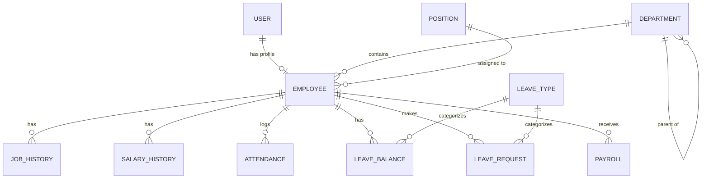

# THIẾT KẾ CƠ SỞ DỮ LIỆU CHUYÊN NGHIỆP: HỆ THỐNG QUẢN LÝ NHÂN VIÊN (EMS)

Tài liệu này cung cấp kiến trúc cơ sở dữ liệu (Database Architecture) toàn diện cho Hệ thống Quản lý Nhân viên (EMS), được thiết kế chuẩn hóa 3NF, tương thích hoàn toàn với **Django ORM** và hệ quản trị **MySQL**.

---

## 1. DATABASE ARCHITECTURE
Hệ thống tuân thủ kiến trúc **Relational Database Management System (RDBMS)**.
- **Engine:** MySQL (InnoDB).
- **Encoding/Collation:** `utf8mb4` / `utf8mb4_unicode_ci` (Hỗ trợ tiếng Việt và Emoji).
- **Mapping:** Tương tác 100% thông qua Django ORM, hạn chế tối đa Raw SQL (trừ các câu query Report phức tạp) để tận dụng Database Abstraction Layer và Migration của Django.
- **Nguyên tắc:** 
  - Tách biệt Authentication (User) và Profile (Employee).
  - Sử dụng Soft Delete cho các dữ liệu danh mục (Department, Position).
  - Dữ liệu giao dịch (Payroll, Attendance) được bảo vệ bằng Restrict/Protect Foreign Key.
  - Lưu trữ dữ liệu lịch sử (Temporal Data) bằng các bảng History riêng biệt.

---

## 2. DATABASE DOMAIN
Hệ thống được chia thành 11 domains chính để dễ quản lý theo mô hình Django Apps:
1. **Auth Domain (`auth`):** User, Role, Permission.
2. **Organization Domain (`org`):** Department, Position.
3. **Employee Domain (`emp`):** Employee, JobHistory, SalaryHistory, Document.
4. **Attendance Domain (`att`):** Attendance.
5. **Leave Domain (`leave`):** LeaveType, LeaveBalance, LeaveRequest.
6. **Payroll Domain (`pay`):** Payroll, Bonus, Deduction.
7. **Performance Domain (`perf`):** PerformanceReview, KPI.
8. **Notification Domain (`notif`):** Notification.
9. **System Logging Domain (`sys`):** AuditLog.

---

## 3. ENTITY LIST & 4. ENTITY ANALYSIS

| Entity Name | Business Purpose | Lifecycle & Security |
|-------------|------------------|----------------------|
| `User` | Quản lý đăng nhập, mật khẩu, RBAC. | Sinh ra khi Onboard, Inactive khi Terminate. (High Security) |
| `Employee` | Lưu trữ hồ sơ lý lịch nhân viên. | Tương đương User. Cập nhật khi có thay đổi nhân thân. |
| `Department` | Cây thư mục phòng ban. | Soft Delete. Hỗ trợ Parent-Child (Self-referencing). |
| `Position` | Chức danh công việc. | Soft Delete. |
| `JobHistory` | Lưu lịch sử chuyển phòng ban / thăng chức. | Dữ liệu Append-only. Không sửa / xóa. |
| `SalaryHistory`| Lưu lịch sử thay đổi mức lương cơ bản. | Append-only. Để đối chiếu cho các kỳ Payroll cũ. |
| `Attendance` | Ghi nhận Check-in/out hàng ngày. | Khóa sau khi chốt công cuối tháng. |
| `LeaveRequest`| Lưu đơn xin nghỉ phép và luồng phê duyệt. | Khóa sau khi Approved/Rejected. |
| `LeaveBalance`| Quỹ phép của nhân viên theo năm. | Reset hoặc cộng dồn vào đầu năm mới. |
| `Payroll` | Lưu trữ thông tin lương thực nhận từng tháng. | Immutable (Không thể thay đổi) sau khi Approved. |
| `AuditLog` | Lưu vết hệ thống. | Hệ thống tự ghi nhận, Không cho phép Update/Delete. |

---

## 5. RELATIONSHIP ANALYSIS
- `User` (1) ➔ (1) `Employee`: Quan hệ **One-to-One**. Một tài khoản chỉ thuộc về một nhân viên.
- `Department` (1) ➔ (N) `Employee`: **One-to-Many**. Nhân viên hiện tại thuộc phòng nào.
- `Department` (1) ➔ (N) `Department`: **Self-Referencing** (One-to-Many). Phòng ban cha - con.
- `Employee` (1) ➔ (N) `JobHistory`: Lưu lịch sử công tác.
- `Employee` (1) ➔ (N) `SalaryHistory`: Lưu lịch sử lương.
- `Employee` (1) ➔ (N) `LeaveRequest`: Đơn xin phép của nhân viên.
- `Employee` (1) ➔ (N) `Payroll`: Danh sách bảng lương các tháng.
- `User` (1) ➔ (N) `AuditLog`: Lịch sử thao tác của User.

---

## 6. ERD (Entity Relationship Diagram)



---

## 7. DATABASE SCHEMA (Core Tables)

### Bảng `emp_employee` (Employee Profile)
| Column | Type | Null | Key | Default | Description |
|--------|------|------|-----|---------|-------------|
| `id` | BigInt | No | PK | Auto | Primary Key |
| `user_id` | Int | No | FK, UQ| None | Link to `auth_user` |
| `emp_code` | Varchar(20) | No | UQ, IDX| None | Mã NV (VD: NV001) |
| `full_name` | Varchar(150)| No | | None | Họ và tên |
| `cccd` | Varchar(20) | No | UQ | None | Căn cước công dân |
| `dob` | Date | Yes | | Null | Ngày sinh |
| `curr_dept_id`| BigInt | Yes | FK, IDX| Null | Phòng ban hiện tại |
| `curr_pos_id` | BigInt | Yes | FK, IDX| Null | Chức vụ hiện tại |
| `status` | Varchar(20) | No | IDX | 'ACTIVE'| ACTIVE, SUSPENDED, RESIGNED |

### Bảng `emp_salary_history` (Historical Salary)
| Column | Type | Null | Key | Default | Description |
|--------|------|------|-----|---------|-------------|
| `id` | BigInt | No | PK | Auto | Primary Key |
| `employee_id` | BigInt | No | FK, IDX| None | Thuộc về nhân viên |
| `base_salary` | Decimal(15,2)| No| | 0.00 | Mức lương cơ sở |
| `effective_date`| Date | No | IDX | None | Ngày bắt đầu áp dụng |
| `end_date` | Date | Yes | | Null | Ngày kết thúc áp dụng (Null = Hiện tại)|

### Bảng `pay_payroll` (Payroll Records)
| Column | Type | Null | Key | Default | Description |
|--------|------|------|-----|---------|-------------|
| `id` | BigInt | No | PK | Auto | |
| `employee_id` | BigInt | No | FK, IDX| None | |
| `period_month`| Int | No | IDX | None | Tháng (1-12) |
| `period_year` | Int | No | IDX | None | Năm |
| `base_salary` | Decimal(15,2)| No| | 0.00 | Snapshot mức lương lúc chốt |
| `work_days` | Decimal(5,2) | No | | 0.00 | Số ngày làm thực tế (từ Attendance) |
| `leave_days` | Decimal(5,2) | No | | 0.00 | Số ngày nghỉ có phép |
| `net_salary` | Decimal(15,2)| No| | 0.00 | Tổng thực nhận |
| `status` | Varchar(20) | No | | 'DRAFT' | DRAFT, APPROVED, PAID |

---

## 8. PRIMARY KEY & 9. FOREIGN KEY DESIGN
- **Primary Key:** Sử dụng `BigAutoField` (BigInt Auto Increment) cho mọi bảng do quy quy mô dữ liệu hệ thống HRM có thể lớn.
- **Foreign Key (ON DELETE Behaviors):**
  - `User` ➔ `Employee`: **CASCADE**. (Xóa User sẽ xóa Profile).
  - `Department` ➔ `Employee`: **PROTECT**. (Không thể xóa phòng ban nếu vẫn còn nhân viên đang trực thuộc).
  - `Employee` ➔ `Payroll` / `Attendance`: **PROTECT**. (Nghiêm cấm xóa nhân viên để bảo vệ dữ liệu kế toán. Phải dùng Soft Delete).

## 10. CONSTRAINT DESIGN
- **Unique Constraint:** `(employee_id, date)` trên bảng `Attendance` để cấm một người Check-in tạo ra 2 record trong cùng một ngày.
- **Unique Constraint:** `(employee_id, period_month, period_year)` trên bảng `Payroll` để đảm bảo 1 tháng chỉ có 1 bảng lương duy nhất.
- **Check Constraint:** `base_salary >= 0`, `leave_balance >= 0`.

## 11. INDEX DESIGN
- **Index:** `status` trên bảng `Employee` (để query lấy danh sách nhân viên đang Active nhanh hơn).
- **Index:** `date` trên bảng `Attendance`.
- **Composite Index:** `(employee_id, effective_date)` trên `SalaryHistory` để tìm kiếm nhanh mức lương tại thời điểm T.

## 12. NORMALIZATION ANALYSIS
- **1NF:** Các file tài liệu (Document) được đưa ra bảng riêng.
- **2NF:** Mọi thuộc tính đều phụ thuộc vào toàn bộ Khóa chính. 
- **3NF:** Không có thuộc tính nào phụ thuộc bắc cầu. 
- *Denormalization có chủ đích:* Trên bảng `Payroll`, cột `base_salary` được lưu lại (Snapshot) thay vì JOIN ngược về bảng `SalaryHistory`. Lý do: Đảm bảo dữ liệu lương tháng cũ không bao giờ bị thay đổi dù cấu trúc lương thay đổi.

## 13. DATA INTEGRITY & 14. SOFT DELETE STRATEGY
- Sử dụng mô hình `Soft Delete` (`is_active = Boolean`) cho các bảng danh mục.
- **Lý do:** Xóa vật lý một Chức vụ sẽ gây lỗi `ProtectedError` hoặc làm mất dữ liệu lịch sử công tác (`JobHistory`).

## 15. HISTORICAL DATA STRATEGY (SCD Type 2)
Áp dụng Slowly Changing Dimension (SCD Type 2) cho Lương:
Khi HR đổi lương nhân viên từ 10tr lên 15tr vào 01/10/2026:
1. Update bản ghi cũ: `end_date = '2026-09-30'`.
2. Insert bản ghi mới: `base_salary = 15.000.000`, `effective_date = '2026-10-01'`, `end_date = NULL`.

## 16. RBAC DATABASE
Tận dụng triệt để hệ thống bảng `auth_group`, `auth_permission`, `auth_user_groups` của Django.

## 17. AUDIT LOG
Thiết kế bảng `sys_audit_log` với quy tắc: Chỉ Insert, Không Update, Không Delete.

## 18. TRANSACTION DESIGN
Mọi logic liên quan đến **Tính lương (Payroll Calculation)** bắt buộc bọc trong `transaction.atomic()` của Django kèm `select_for_update()` để tránh Race Condition.

## 19. REPORTING DESIGN
- **Attendance Report:** Query bảng `Attendance` filter theo khoảng ngày (`date__range`), GROUP BY `employee_id`.

## 20. DJANGO ORM MAPPING (Sample)
```python
class Employee(models.Model):
    user = models.OneToOneField(User, on_delete=models.CASCADE, related_name='employee_profile')
    emp_code = models.CharField(max_length=20, unique=True, db_index=True)
    curr_dept = models.ForeignKey('Department', on_delete=models.PROTECT, null=True)
    
    class Meta:
        db_table = 'emp_employee'
```

## 21. DATABASE SECURITY
- **Password:** Băm bằng PBKDF2 (Mặc định của Django).
- **Environment:** Thông tin kết nối MySQL không hardcode trong `settings.py` mà đọc từ `.env`.

## 22. MIGRATION STRATEGY
Tuân thủ 100% cơ chế Migration của Django. Không can thiệp qua phpMyAdmin/DBeaver.

## 23. SAMPLE DATA FLOW (Payroll)
[Attendance + SalaryHistory] ➔ Aggregation Query ➔ In-memory Calculation ➔ Mở Transaction ➔ INSERT vào `pay_payroll` ➔ Commit Transaction.

## 24. RECOMMENDATIONS
1. **Connection Pooling:** Cấu hình `CONN_MAX_AGE` trong Django.
2. **Archiving:** Có chiến lược Partitioning trên MySQL theo Năm cho bảng Attendance/AuditLog.
3. **Database Caching:** Đưa Danh mục (Department, LeaveType) lên Redis.
